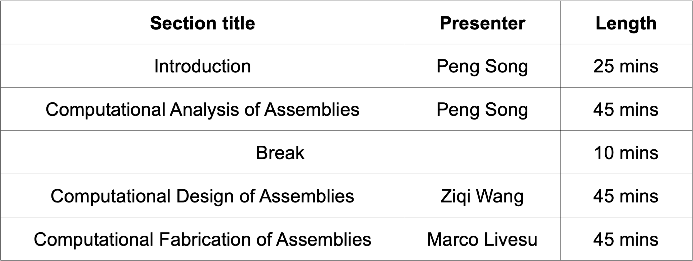

Introduction
=============

.. _intro:

An assembly refers to a collection of parts joined together to achieve a specific form and/or functionality. 
Assemblies enable to build large and complex objects by assembling a set of small and simple parts, facilitating their fabrication, storage, maintenance, and usage.
Due to this reason, assemblies are ubiquitous in our daily life, existing in a wide variety of scales and geometric forms; typical examples include toys, electronic devices, furniture,  and architecture.
While assemblies have intriguing properties, designing assemblies is a non-trivial task, even for professionals. 
A slight modification on an individual part could have a global impact on the aesthetical, structural, and/or functional performance of the whole assembly.
Ensuring that all parts can be put together and properly joined to form the final assembly is another challenge.
To address these challenges, researchers have developed various computational techniques for designing and fabricating assemblies :cite:p:`Attene-2018-DesignForAdditiveManufacturing`, :cite:p:`Bickel-2018-StylizedFabrication`, :cite:p:`Wang-2021-AssemblySurvey`.

In this tutorial, we define **computational assemblies** as an emerging research area in computer graphics that studies computational techniques for analyzing, designing, and fabricating assemblies.
Computational assemblies provide new ways for general users to easily design and make their personalized assemblies.
Users just need to specify their high-level specifications on assemblies and then computational tools that encapsulate the needed low-level knowledge will automatically generate and optimize designs to satisfy these specifications.
For example, if a user wants to design a 6-piece equilibrium puzzle that looks like a bunny, then his/her high-level specifications on assemblies would be the number of puzzle pieces, equilibrium under gravity, and assembly appearance.
The design generated from the computational tools typically consists of the final detailed shape of each component part for fabrication and the assembly instruction of parts for installation.
%The objective of this tutorial is to give the audience an introduction to 

In general, computational assemblies address two different goals.
The first goal is computational design of assemblies for a specific application, e.g., puzzles for entertainment :cite:p:`Song-2012-InterCubes` and furniture for supporting human activities :cite:p:`Yao-2017-DecorativeJoinery`; see teaser image.
The second goal is computational fabrication of complex shapes as assemblies for addressing limitations of a specific digital fabrication technique, e.g., approximating a 3D shape with a set of planar parts for laser cutting :cite:p:`Cignoni-2014-MeshJoinery`; see teaser image (bottom).
Besides computational design and fabrication, computational analysis of assemblies is necessary and crucial, not only for evaluating the resulting designs, but also for guiding the whole design process.
This tutorial will introduce computational techniques for analysis, design, and fabrication of assemblies, respectively; see the following table for the tutorial outline.

